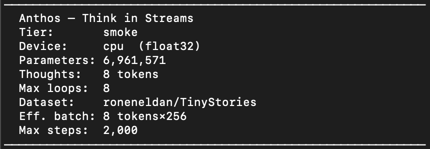

<div align="center">
<a href="https://ibb.co/6JtCgPJ1"></a>

  <h1>Anthos</h1>
  <p><strong>Think in Streams.</strong></p>

  [](https://python.org)
  [](https://pytorch.org)
  [](LICENSE)
  [](docs/architecture.md)
  [](tests/test_anthos.py)

</div>

---

## What is Anthos?

Anthos is a **Thought-Token Bifurcated Recurrent Transformer** — a new architecture class that separates *reasoning state* from *content state* into two parallel streams running through a shared recurrent core.

Most language models collapse these two concerns into a single hidden state. Anthos keeps them apart by design.

```
Input tokens
  ↓
[Embedding]
  ↓
[Prelude]          — standard transformer blocks
  ↓
[Recurrent Block × T loops]
  ├─ [thought₁…thoughtₙ | tok₁…tokₜ]  ← processed together every loop
  ├─ Thought stream: non-causal, sees full context, explicit working memory
  └─ Sequence stream: causal, carries content, produces output
  ↓
[Coda]             — standard transformer blocks
  ↓
Output logits (sequence only — thought tokens are internal, leave no trace)
```

---

## The Core Innovation: Thought Tokens

A small pool of `n_thought` learnable vectors is prepended to the hidden state inside every recurrent loop iteration. They are **not** input tokens — they carry no vocabulary content. They are explicit working-memory slots.

### Attention mask
```
              [thoughts]   [sequence]
[thoughts]       ████  →    ████        ← thoughts see everything
[seq tok 0]      ████  →    ██▒▒▒▒▒▒    ← seq sees thoughts + causal past
[seq tok 1]      ████  →    ████▒▒▒▒▒
[seq tok T]      ████  →    ████████
```

Thought tokens attend to the **full sequence non-causally**. Sequence tokens attend to **all thoughts + their causal past**. At output, thought tokens are discarded — they leave no token trace, only shape what the sequence stream produces.

### Why this matters

| Property | Standard Transformer | OpenMythos (RDT) | **Anthos** |
|---|---|---|---|
| Reasoning mechanism | Implicit in weights | Recurrent hidden state | **Explicit thought stream** |
| Context access | Causal only | Causal only | **Thoughts: non-causal** |
| Working memory | None | Implicit LTI state | **Dedicated thought tokens** |
| Content/reasoning separation | None | None | **Bifurcated by design** |
| Compute-adaptive | No | ACT halting | **ACT on sequence; thoughts run every loop** |

---

## Architecture Details

### Dual-stream LTI Update

Both streams use an **energy-conserving LTI injection** — a provably stable recurrent update:

```python
# Energy-conserving: h norm cannot grow across any number of loops
combined   = alpha * transformer_out + (1 - alpha) * B * gated_e
h_{t+1}    = A * h_t + (1 - A) * combined

# where:
# A ∈ (0,1) guaranteed by ZOH discretization (spectral radius < 1 by construction)
# alpha = sigmoid(W · cat([h, t_out]))   ← learned residual gate, per-channel
# gated_e = sigmoid(W_gate · e) * e     ← soft input mask
```

The sequence stream and thought stream each have **independent LTI parameters** — they evolve at their own learned rates.

### RoPE for Thought Tokens

Thought tokens all receive **position-0 frequencies** in rotary embeddings. They attend from a fixed neutral reference — thoughts are working-memory slots, not sequential positions, so assigning them sequential positions would be misleading.

### MoE FFN

The recurrent block uses a **fine-grained Mixture-of-Experts** FFN with vectorized dispatch:

- Tokens sorted by assigned expert (coalesced memory access, no GPU sync loops)
- Load-balancing loss tracked automatically via `pop_aux_loss()`
- Shared experts always active for cross-domain common patterns

### Memory Bank

Each recurrent block contains a **512-slot persistent KV memory** — a differentiable external memory that thought tokens cross-attend every loop iteration. The memory state persists across generation steps, giving Anthos an RNN-style working memory layer on top of the transformer.

```python
# Thought tokens read from and write to the memory bank each loop
thoughts, memory_state = self.memory_bank(thoughts, memory_state)
```

---

## Quick Start

```bash
git clone https://github.com/TushaeBXN/anthos
cd anthos
pip install torch
```

```python
import torch
from anthos import Anthos, AnthosConfig

cfg = AnthosConfig(
    vocab_size=32000,
    dim=512,
    n_heads=8,
    n_kv_heads=4,
    max_seq_len=1024,
    max_loop_iters=8,
    n_thought_tokens=16,
    attn_type="gqa",
    n_experts=16,
    expert_dim=256,
)

model = Anthos(cfg)
print(f"Parameters: {sum(p.numel() for p in model.parameters()):,}")

# Forward pass
ids    = torch.randint(0, 32000, (1, 64))
logits = model(ids, n_loops=8)
print(f"Logits: {logits.shape}")   # (1, 64, 32000)

# With auxiliary losses (use during training)
logits, aux = model(ids, n_loops=8, return_aux=True)
loss = cross_entropy_loss + aux

# Generation
out = model.generate(ids, max_new_tokens=128, n_loops=12)
```

---

## Training

```python
from anthos import Anthos, anthos_1b
import torch.nn.functional as F

model = Anthos(anthos_1b())

# Training step
logits, aux_loss = model(input_ids, n_loops=8, return_aux=True)
ce_loss  = F.cross_entropy(
    logits[:, :-1].reshape(-1, cfg.vocab_size),
    input_ids[:, 1:].reshape(-1)
)
loss = ce_loss + aux_loss   # aux handles MoE load balancing + ACT penalty
loss.backward()
```

### Training tiers

| Tier | Hardware | Dataset | Steps | Purpose |
|---|---|---|---|---|
| `smoke` | MacBook CPU | TinyStories | 10,000 | Sanity check — loss decreases |
| `proof` | Single GPU (A100/4090) | TinyStories | 10,000+ | Coherent readable text |
| `instruct` | GPU | Alpaca 52k | 500 | Instruction following |
| `sft` | GPU | SlimOrca 517k | 500 | Conversation fine-tune |
| `history` | CPU/GPU | Local markdown files | 5,000 | Domain/style fine-tuning |
| `ethnic` | CPU/GPU | Global African Storybook | 10,000 | Cultural domain fine-tuning |
| `convo_smoke` | GPU | Claude-generated teacher data | 50,000–150,000 | Instruction following (teacher distill) |
| `distill` | CPU/GPU | Teacher labels (offline) | 10,000 | Knowledge distillation |

```bash
# Start any tier
python3 train.py --tier smoke
python3 train.py --tier proof
python3 train.py --tier history

# Resume from checkpoint
python3 train.py --tier sft --resume checkpoints/mansa_sovereign/step_010000.pt

# Override steps at the command line (new)
python3 train.py --tier convo_smoke \
  --resume checkpoints/mansa_sovereign/step_001700.pt \
  --steps 150000
```

### Teacher Data Pipeline

Anthos uses Claude Haiku as a teacher model to generate high-quality instruction-following training data:

```bash
# Generate 5,000 teacher conversations (~$8 on Claude API)
python3 generate_claude_data.py --n 5000 --budget 9.50

# Clean: filter AI-isms, trim verbose responses
python3 clean_training_data.py
# → teacher_conversations_clean.jsonl  (4,768 / 5,000 examples kept)
```

The pipeline covers 60+ topics across 10 instruction templates. Responses are trimmed to ≤200 words and filtered for AI-ism contamination ("As an AI...", "Great question!", etc.) before training.

### Recommended training phases

| Phase | Loops | ACT | Goal |
|---|---|---|---|
| 1 — Stabilization | 4 (fixed) | Off | Loss decreases, no NaNs |
| 2 — Adaptive compute | 8–12 | On | Halting distribution healthy |
| 3 — Scale | Max | On | Benchmark targets |

---

## Model Variants

| Variant | `dim` | Experts | Thought Tokens | Loop Iters | Context |
|---|---|---|---|---|---|
| `anthos_1b` | 2048 | 64 | 16 | 16 | 4k |
| `anthos_3b` | 3072 | 64 | 24 | 16 | 4k |
| `anthos_10b` | 4096 | 128 | 32 | 24 | 8k |
| `anthos_50b` | 6144 | 256 | 48 | 32 | 8k |
| `anthos_100b` | 8192 | 256 | 64 | 32 | 1M |

```python
from anthos import anthos_1b, anthos_3b, Anthos

cfg   = anthos_1b()
model = Anthos(cfg)
```

---

## Features

### Sovereign Rogue — Activation Steering

Anthos supports **non-destructive personality injection** via activation addition. A steering vector is extracted from contrastive sentence pairs and added to the recurrent block's hidden states at inference time — no retraining required.

```python
from anthos.steering import AnthosSteer

steer = AnthosSteer(model, target="recurrent")
steer.load_persona("vectors/tars_rogue.pt")
steer.engage(strength=0.75)

output = model.generate(prompt_ids, max_new_tokens=128, n_loops=16)
steer.disengage()
```

```bash
# Generate your own persona vector from contrastive sentence pairs
# 1. Edit data/persona_pairs.json with your pos/neg pairs
# 2. Run the factory script once
python3 generate_vector.py
# → saves vectors/tars_rogue.pt
```

Supported hook targets: `"recurrent"` (recommended) · `"prelude_N"` · `"coda_N"`

**Default vs Sovereign Rogue (smoke tier, 10k steps)**

| Prompt | Default | Sovereign Rogue |
|---|---|---|
| *"The small robot looked at"* | *"the box and the box and the box their room a big slide..."* | *"the big grass and walked away some water the big rock in a jar..."* |
| *"In a world where"* | *"a big box that look for a big Timmy to make someone..."* | *"they had so the fun together they all day and they named they would play..."* |

The Rogue vector shifts generation toward longer connected scenes, less repetition, and richer environmental detail — extracted from 5 contrastive sentence pairs, zero extra training.

---

### Sparse Autoencoder (SAE) Interpretability

Train a sparse autoencoder on Anthos activations to discover interpretable features in the thought and sequence streams.

```python
from anthos.sae import SparseAutoencoder, SAEConfig
from anthos.steering import ActivationCollector

# Collect activations
collector = ActivationCollector(model, stream="thought")
collector.attach()
model(input_ids, n_loops=8)
acts = collector.flat_activations()   # [N, D]

# Train SAE
sae_cfg = SAEConfig(d_model=512, expansion=16, k=64)
sae = SparseAutoencoder(sae_cfg)
```

```bash
python3 sae_train.py --tier proof --steps 5000
```

---

### Knowledge Distillation

Train a smaller Anthos student model on soft labels from a larger teacher (Qwen3, LLaMA, etc.).

```bash
# Step 1: generate soft labels with a large teacher (run once, on GPU or cloud)
python3 generate_teacher_labels.py \
    --teacher Qwen/Qwen3-7B \
    --dataset roneneldan/TinyStories \
    --n_samples 50000 \
    --out data/teacher_labels_qwen7b.jsonl

# Step 2: train Anthos student on those labels
python3 train.py --tier distill --teacher_labels data/teacher_labels_qwen7b.jsonl
```

Teacher recommendations by hardware:
- **M1 Max / Apple Silicon** → Qwen3-14B Q4_K_M via llama.cpp (~8GB)
- **Cloud GPU (recommended)** → Qwen3-32B or LLaMA-3.1-70B on a rented A100 (~$1/hr)

---

### KV Cache & Fast Generation

Anthos uses a **bifurcated cache strategy** — the sequence stream uses a standard causal KV cache while thought tokens are recomputed each step (required for their non-causal full-context access). The LTI hidden state is cached between generation steps.

```python
from anthos.kv_cache import CachedGenerator, CacheConfig

gen = CachedGenerator(model, CacheConfig(
    max_seq_len=1024, n_heads=8, head_dim=64, n_thought_tokens=16
))
output = gen.generate(input_ids, max_new_tokens=256, n_loops=12)
```

---

### GRPO — Reinforcement Learning for the Thought Stream

GRPO teaches the thought stream to reason deliberately by rewarding good completions rather than relying solely on next-token prediction.

```python
from anthos.grpo import GRPOTrainer, GRPOConfig, quality_reward

trainer = GRPOTrainer.from_pretrained(
    checkpoint_path = "checkpoints/mansa_sovereign/step_005000.pt",
    model_class     = Anthos,
    cfg             = model_cfg,
    tokenizer       = tokenizer,
    grpo_config     = GRPOConfig(n_completions=8, kl_coef=0.05),
)

for batch in loader:
    loss = trainer.step(batch["input_ids"])
    optimizer.zero_grad()
    loss.backward()
    optimizer.step()
```

Reward functions: `quality_reward` (diversity + repetition penalty), `loop_efficiency_reward` (fewer loops = higher reward). Plug in any custom reward model for stronger signal. **Run GRPO after pretraining is stable — not from scratch.**

---

### EAFT — Entropy-Aware Focal Training Loss

Weights the cross-entropy loss by position-level entropy — uncertain positions get more gradient, confident ones get less. Pairs with the Anthos ACT halting signal: positions that needed more loop iterations receive extra weight automatically.

```python
from anthos.eaft import EAFTLoss

criterion = EAFTLoss(
    vocab_size      = cfg.vocab_size,
    top_k           = 50,
    focal_gamma     = 1.0,   # entropy weight strength (0 = standard CE)
    act_gamma       = 0.5,   # extra weight for high-ponder positions
    label_smoothing = 0.1,
)

# In training loop — drops in as a direct replacement for F.cross_entropy
loops_used = getattr(model, "_last_loops_used", None)
loss = criterion(logits, labels, attention_mask=mask, loops_used=loops_used)
```

---

### Multipack — Sequence Packing

Eliminates padding waste by bin-packing variable-length sequences into fixed-length chunks. Each chunk is ~100% token-utilised. Includes a block-diagonal attention mask that prevents cross-document attention leakage inside a pack.

```python
from anthos.multipack import MultipackDataset, MultipackSampler, multipack_collate
from torch.utils.data import DataLoader

dataset = MultipackDataset(
    file_paths = [Path("data/new_history/essay1.md"), ...],
    tokenizer  = tokenizer,
    chunk_len  = 4096,
)
loader = DataLoader(dataset, batch_size=2, sampler=MultipackSampler(dataset),
                    collate_fn=multipack_collate)
```

Or use the one-liner builder from `train_additions.py`:
```python
from anthos.train_additions import build_dataloader
loader = build_dataloader("data/new_history", tokenizer, chunk_len=256)
```

---

### Dual LoRA — Depth-Adaptive Adapters

Replaces the single LoRA adapter with two independent paths blended by loop depth. Early loops use the `fast_lora` path (content routing); late loops use the `deep_lora` path (reasoning integration). The blend temperature is a learned scalar — already wired into `AnthosRecurrentBlock` in `main.py`.

---

### FP8 Quantization (Inference)

```python
from anthos.quant import load_quantized, QuantConfig

model = load_quantized(
    model,
    "checkpoints/mansa_sovereign/step_005000.pt",
    quant_cfg = QuantConfig(mode="auto"),   # fp8 on H100, bf16 elsewhere
)
```

FP8 cuts inference memory ~50% vs BF16. Requires H100 for true FP8; auto-falls back to BF16 on older GPUs and MPS.

---

### RunPod Serverless

```bash
# Local test
python -m anthos.serve --test

# Deploy — set env vars and point RunPod to your Docker image
# MODEL_CHECKPOINT=checkpoints/... QUANT_MODE=auto N_LOOPS=12
```

The server exposes an OpenAI-compatible `/v1/completions` endpoint with Engram memory retrieval and FP8 quantization built in. See `anthos/serve.py` for the full Dockerfile instructions.

---

### Export & Deployment

```python
from anthos.export import export_for_deployment

# One-shot: safetensors + HF config + GGUF metadata
export_for_deployment(model, model_cfg, "exports/anthos-1b/", dtype="bfloat16")

# Load in HF Transformers
# AutoModelForCausalLM.from_pretrained("exports/anthos-1b/", trust_remote_code=True)

# Convert to GGUF for Ollama / LM Studio
# python llama.cpp/convert_hf_to_gguf.py exports/anthos-1b/ --outtype q4_k_m
```

---

## Project Status

<div align="center">
  
  <p><em>5 training runs across CPU and H100 GPU. 44.9M parameter proof model reached loss 2.90 in under 2 minutes on H100. Teacher data pipeline live — 5,000 Claude-generated instruction examples queued for fine-tuning.</em></p>
</div>

### Training History

| Run | Hardware | Dataset | Steps | Params | Final Loss | Date |
|---|---|---|---|---|---|---|
| **smoke** | MacBook CPU | TinyStories | 10,000 | **6.9M** | 10.99 | Apr 23, 2026 |
| **ethnic** | MacBook CPU | Global African Storybook | +10,000 | **6.9M** | 11.48 | Apr 25, 2026 |
| **proof** | H100 SXM (RunPod) | TinyStories | 1,700 | **44.9M** | 2.90 | Apr 25, 2026 |
| **sft** | H100 SXM (RunPod) | SlimOrca (517k convos) | 1,000 | **44.9M** | 3.92 | Apr 25, 2026 |
| **convo_smoke** | RTX 4090 (RunPod) | Claude Haiku teacher data (4k) | 51,000 | **44.9M** | ~1.90 | May 2026 |
| **qwen_lora** | T4 (Google Colab) | Claude Haiku teacher data (4k) | 1,536 | **1.5B** | ~1.87 | May 2026 |

**Best checkpoint:** `qwen_lora` final — loss ~1.87 (1.5B params, LoRA fine-tune on Qwen2.5-1.5B-Instruct)

**Architecture milestones since v0.1:**
- `v0.1` — 6.9M param smoke model, loss ~11 (MacBook CPU, TinyStories, ~2 hrs)
- `v0.2` — 44.9M param proof model, loss 2.90 (H100, 1,700 steps, ~2 min)
- `v0.3` — DualLoRA, EAFT loss, Multipack, FP8 quant, GRPO, Memory Bank all wired
- `v0.4` — Claude Haiku teacher pipeline: 4k instruction examples, cleaned + shuffled
- `v0.5` — LoRA fine-tune on Qwen2.5-1.5B-Instruct (1.5B params), first live conversation, identity training pipeline, RoPE dynamic scaling to 1M context

---

## What makes Anthos different

**vs. standard transformers** — adds recurrent depth and explicit working memory; reasoning depth scales with inference-time compute, not parameter count.

**vs. RWKV / Mamba** — not a sequence model replacement. Anthos is a full transformer with an additive thought-token stream. Full attention is preserved, recurrence is additive.

**vs. OpenMythos / Universal Transformer** — both loop the same hidden state. Anthos bifurcates into two streams with independent dynamics. The thought stream accumulates global context; the sequence stream stays causal and content-focused.

**vs. register tokens (Darcet et al. 2023)** — register tokens are a training-time artifact for attention sink mitigation. Anthos thought tokens are an architectural primitive with their own LTI update rule, evolving across loop iterations with independent learned parameters.

---

## Documentation

| Page | Description |
|---|---|
| [`docs/architecture.md`](docs/architecture.md) | Full architecture reference — all components, equations, design decisions |
| [`docs/INTEGRATION.md`](docs/INTEGRATION.md) | SAE, steering, and SASFT integration guide |
| [`docs/MEMORY_INTEGRATION.md`](docs/MEMORY_INTEGRATION.md) | Memory Bank wiring guide |
| [`examples/minimal.py`](examples/minimal.py) | Load checkpoint + Sovereign Rogue side-by-side demo |
| [`examples/variants.py`](examples/variants.py) | All model size variants |
| [`anthos/main.py`](anthos/main.py) | Core model implementation |
| [`anthos/steering.py`](anthos/steering.py) | Activation steering — `AnthosSteer` + `ActivationCollector` |
| [`anthos/sae.py`](anthos/sae.py) | Sparse autoencoder for interpretability |
| [`anthos/memory.py`](anthos/memory.py) | 512-slot persistent memory bank |
| [`anthos/distill.py`](anthos/distill.py) | Knowledge distillation pipeline |
| [`anthos/kv_cache.py`](anthos/kv_cache.py) | Bifurcated KV cache for fast generation |
| [`anthos/export.py`](anthos/export.py) | Safetensors, HF config, GGUF export |
| [`anthos/eaft.py`](anthos/eaft.py) | Entropy-Aware Focal Training loss |
| [`anthos/grpo.py`](anthos/grpo.py) | Group Relative Policy Optimization |
| [`anthos/multipack.py`](anthos/multipack.py) | Sequence packing — eliminates padding waste |
| [`anthos/lora_pairs.py`](anthos/lora_pairs.py) | Dual LoRA adapter (fast/deep loop paths) |
| [`anthos/quant.py`](anthos/quant.py) | FP8 inference quantization |
| [`anthos/serve.py`](anthos/serve.py) | RunPod serverless worker (OpenAI-compatible) |
| [`anthos/train_additions.py`](anthos/train_additions.py) | Drop-in training integration shim |

---

## Citation

```bibtex
@software{thomas2026anthos,
  author    = {Tushae Thomas},
  title     = {Anthos: Thought-Token Bifurcated Recurrent Transformer},
  year      = {2026},
  url       = {https://github.com/TushaeBXN/anthos},
  note      = {Bifurcated Recurrent Transformer with Thought Tokens, Energy-Conserving LTI, MoE, and ACT halting}
}
```

---

## License

MIT License — Copyright (c) 2026 Tushae Thomas. See [LICENSE](LICENSE) for full text.

---

<div align="center">
  <sub>Built by <a href="https://github.com/TushaeBXN">Tushae Thomas</a> · Think in Streams.</sub>
</div>
